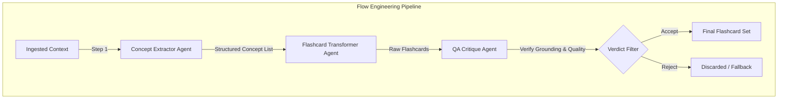
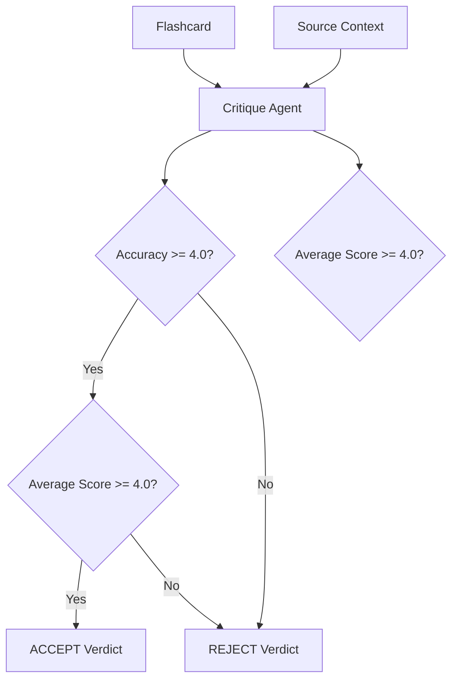
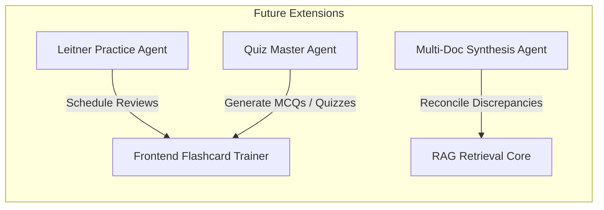

# Agentic Architecture & Flow Engineering (AGENTS.md)

This document explains the agentic behaviors, cognitive patterns, and Flow Engineering designs implemented in the GenAI Flashcard Generator.

---

## 1. Flow Engineering vs. Single-Prompt Generation

Rather than asking a single LLM call to read the context and output finished flashcards directly, this application splits the cognitive workload into distinct roles using **Flow Engineering**. This mitigates hallucinations, improves factual grounding, and ensures strict adherence to structural schemas.

This pattern implements a **Generator-Critic** architecture, dividing the generation task from the quality evaluation task.

---

## 2. Agent Roles and Specifications

### 2.1 The Concept Extractor Agent (`ExtractorChain`)

*   **Role**: Expert Knowledge Extractor.
*   **Prompt System Instruction**: Located in [prompts.py](file:///g:/Documents/Utils/genai-rag/backend/app/generation/prompts.py).
*   **Cognitive Objective**: Read a text block and extract all major educational points (definitions, procedures, relationships, and examples).
*   **Constraints**:
    *   *Grounding*: Do not assume or extrapolate; extract only facts explicitly mentioned.
    *   *Citation Integrity*: Track and preserve bracketed citation markers (e.g. `[1]`) found in source text and attach them to the concept quotes.
*   **Structured Schema Output**: Enforced using Pydantic's `ConceptList` and `Concept`.

### 2.2 The Flashcard Transformer Agent (`TransformationChain`)

*   **Role**: Expert Curriculum & Instructional Designer.
*   **Prompt System Instruction**: Located in [prompts.py](file:///g:/Documents/Utils/genai-rag/backend/app/generation/prompts.py).
*   **Cognitive Objective**: Transform a single structured concept representation into an exam-ready Question and Answer pair.
*   **Design Principles**:
    *   Vary question styles (Definitions, Explanations, Comparisons, Procedures, Applications).
    *   Ensure answers are self-contained and do not contain markdown bold/italic formatting (cleaned up via Pydantic validators).
    *   Map the concept's citation ID into the card's `citation` property.
*   **Structured Schema Output**: Enforced using Pydantic's `Flashcard`.

### 2.3 The Quality Assurance Critic Agent (`CritiqueChain`)

*   **Role**: Academic Quality Auditor.
*   **Prompt System Instruction**: Located in [self_correction.py](file:///g:/Documents/Utils/genai-rag/backend/app/validation/self_correction.py).
*   **Cognitive Objective**: Compare a generated card against its original source context and evaluate its validity across four standard criteria.
*   **Evaluation Criteria (Score 1-5)**:
    1.  **Accuracy (Critical)**: Checking for hallucinations or imprecisions.
    2.  **Completeness**: Checking if the answer captures all crucial information required by the question.
    3.  **Clarity**: Verifying the question is unambiguous and easy to understand.
    4.  **Relevance**: Verifying that the question/answer represents a useful study concept.

*   **Decision Verdict Rules**:
    *   **ACCEPT**: Average score across all four criteria must be $\ge 4.0$ **AND** the Accuracy score must be $\ge 4.0$.
    *   **REJECT**: Triggered if the card fails the average score threshold or has any accuracy issues. Rejected cards are deleted from the final output set to preserve study accuracy.

---

## 3. Potential Agentic Extensions

To expand the project's educational capabilities, the following agents could be integrated:

### 3.1 Leitner / Spaced-Repetition Study Agent
*   **Objective**: Manage the user's learning schedule.
*   **Capabilities**:
    *   Track user review feedback ("Easy", "Medium", "Hard", "Failed").
    *   Dynamically bin cards into Leitner review boxes (Box 1: every day, Box 2: every 2 days, etc.).
    *   Serve cards at optimal intervals to maximize memorization efficiency.

### 3.2 Interactive Quiz Master Agent
*   **Objective**: Conduct active-recall testing.
*   **Capabilities**:
    *   Generate multiple-choice or fill-in-the-blank questions based on generated flashcards.
    *   Provide personalized critiques of user answers, detailing why their choice was correct or incorrect relative to the source documents.

### 3.3 Multi-Document Synthesis Agent
*   **Objective**: Resolve contradictions or synthesize information across multiple uploaded documents.
*   **Capabilities**:
    *   Detect conflicts (e.g., Doc A claims X; Doc B claims Y).
    *   Create synthesized concepts summarizing both perspectives or resolving contradictions with the help of a broader web/knowledge-graph lookup.
