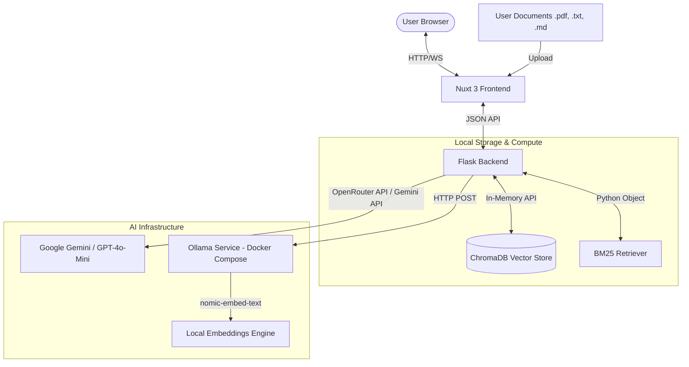
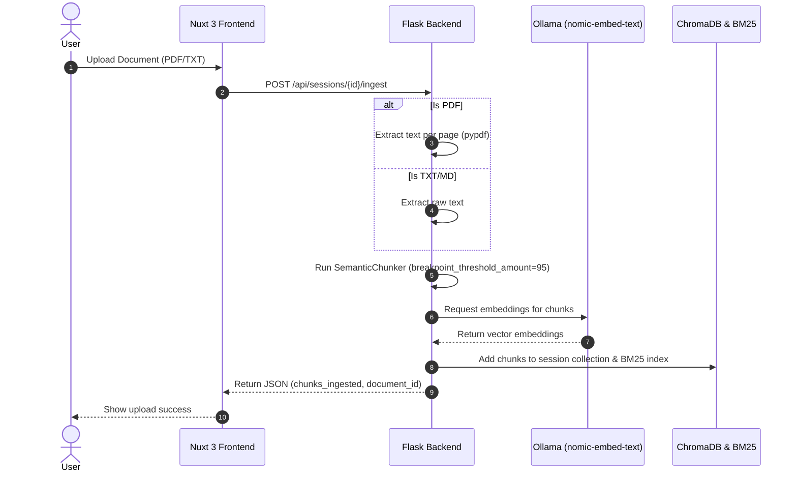
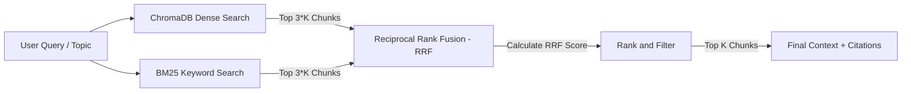
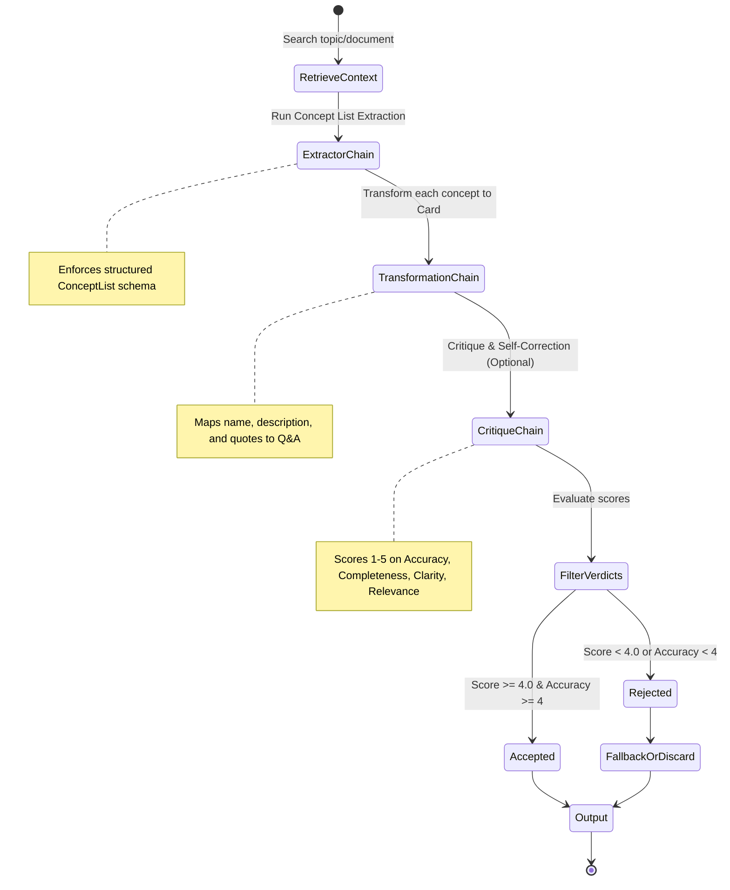

# System Architecture: GenAI Flashcard Generator

This document details the architectural design, system components, data flows, and Retrieval-Augmented Generation (RAG) pipeline for the GenAI Flashcard Generator application.

---

## 1. High-Level System Architecture

The application is structured as a decoupled multi-tier web application consisting of a modern frontend interface, a lightweight REST API backend, and local/remote AI integration layers.



### Components

1.  **Frontend (Nuxt 3 / Vue 3)**: A responsive single-page application (SPA) built with Nuxt 3, utilizing `@nuxt/ui` (Tailwind-based) and components for managing sessions, documents, chat interfaces, and flashcard practice.
2.  **Backend (Flask)**: A Python Flask web server exposing API endpoints for session control, file ingestion, hybrid search-based chat, and structured flashcard generation.
3.  **Local Services (Ollama in Docker)**: Runs the embedding service using the `nomic-embed-text` model in a Docker container.
4.  **LLM Layer (OpenRouter / Google Gemini)**: Provides LLM execution. Supports OpenRouter (defaulting to `openai/gpt-4o-mini`) and direct Google Gemini models (defaulting to `gemini-2.5-flash`) via LangChain adapters to handle chat completions, concept extractions, card transformations, and self-critiques.


---

## 2. Ingestion & RAG Pipeline

The application features a session-isolated RAG pipeline to prevent document leakage across user sessions.

### Ingestion Flow



1.  **Text Extraction**: PDF files are parsed using `pypdf` page by page, preserving page numbers. TXT and MD files are read as raw UTF-8 text.
2.  **Semantic Chunking**: Instead of fixed-character chunking, the project employs LangChain Experimental's `SemanticChunker`. 
    *   **Breakpoint Method**: `percentile` (threshold = 95).
    *   **Model**: Ollama's local `nomic-embed-text`.
    *   **Metadata**: Each chunk captures `document_id`, `source` (filename), `page_number`, `chunk_index`, character start/end offsets, and a unique `citation_id` formatted as `{document_id}:p{page_number}:c{chunk_index}`.
3.  **Vector & Keyword Storage**: Chunks are embedded and stored in an in-memory ChromaDB collection, and simultaneously added to an in-memory BM25 index for sparse keyword matching.

---

## 3. Hybrid Search & Retrieval Fusion

The system uses a hybrid retrieval mechanism combining dense and sparse search to maximize recall and precision.



### Reciprocal Rank Fusion (RRF)
Dense results from ChromaDB (using cosine distance on local embeddings) and sparse results from BM25 are fused together. The scoring formula for each chunk $d$ is:

$$RRF\_Score(d) = \sum_{m \in \{dense, sparse\}} \frac{1}{rrf\_k + rank_m(d)}$$

Where:
*   $rrf\_k$ is set to `60` (the smoothing constant).
*   $rank_m(d)$ is the 1-based rank position of chunk $d$ in retriever $m$. If a chunk is not retrieved by a retriever, its rank term is omitted.
*   The top $k$ chunks with the highest fused score are selected.

---

## 4. Citation Generation & Grounded Context

When preparing context for the Chat and Flashcard engines, the retrieved chunks are formatted into a single string. To provide precise academic citations, the backend maps citation indices to chunks dynamically.

```python
# Format returned to LLMs:
[Source 1: lecture.pdf | Page: 3 | Section: N/A]
"Semantic search allows matching text by conceptual similarity..."

[Source 2: notes.txt | Page: N/A | Section: N/A]
"Dense vector embeddings represent text as high-dimensional coordinates..."
```

As the answer is generated by the LLM, the source citation numbers (e.g., `[1]`, `[2]`) are extracted and returned as structured metadata in the JSON response, allowing the frontend to highlight the corresponding chunks.

---

## 5. Flashcard Generation & Flow Engineering

Generating high-quality, educationally-sound flashcards from raw context relies on a **Flow Engineering** pattern rather than a single prompt.



1.  **Extraction**: The `ExtractorChain` uses structured output to identify distinct `Concept` models from the context.
2.  **Transformation**: The `TransformationChain` takes each extracted concept and designs a custom Question/Answer pair, assigning an educational tag (`definition`, `concept`, `procedure`, `comparison`, or `application`).
3.  **Self-Correction**: The `CritiqueChain` acts as a validation agent. It compares each card against the source text and scores it. Cards that score poorly are filtered out or corrected.

---

## 6. Session and Memory Lifecycle

*   **Isolation**: Every active session has an isolated session memory structure mapping to its own ChromaDB collection: `session_{session_id}`.
*   **Volatile Storage**: The system operates with an in-memory client `chromadb.Client()`. Sessions and databases persist only as long as the backend server is running.
*   **Teardown**: A `DELETE /api/sessions/{session_id}` request drops the associated ChromaDB collection and clears the session's memory footprint on the Flask server.
