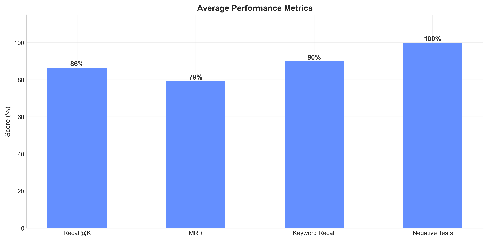
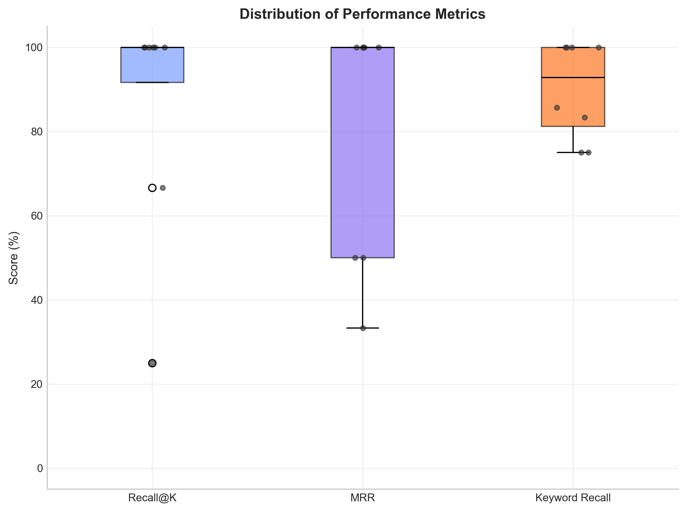
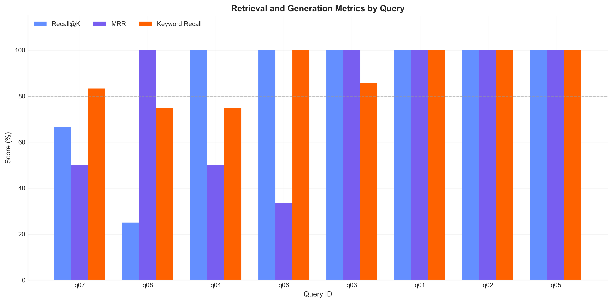
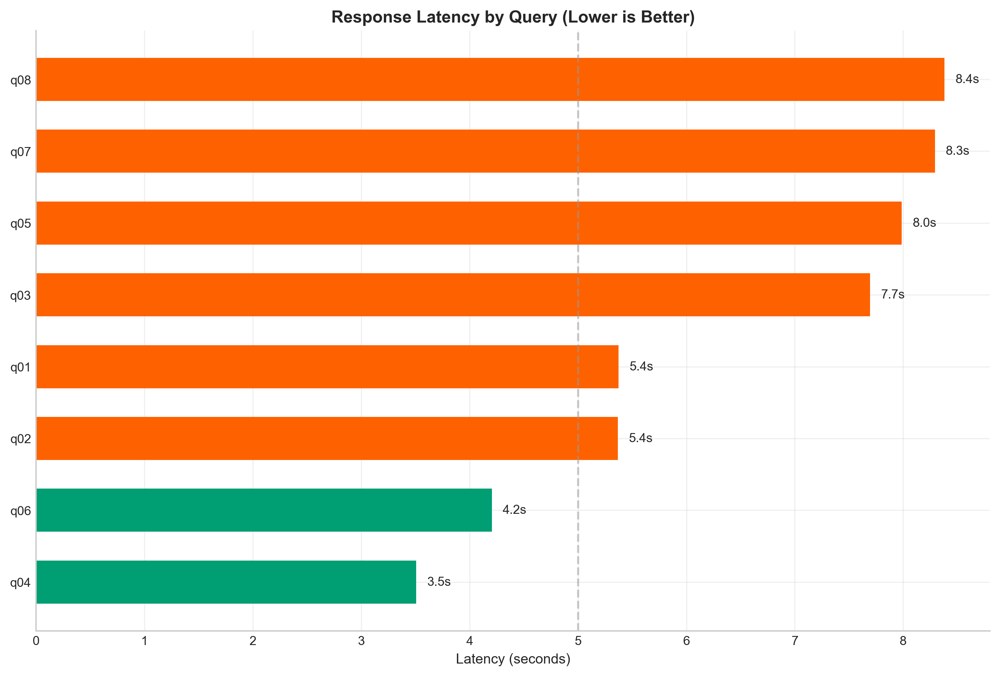

# Evaluation Visual Results

Visual analysis of RAG system performance across 8 test queries and 3 negative test cases.

> [!NOTE]
> Generate plots with: `python generate_plots.py` (requires `matplotlib` and `numpy`)

---

## Performance Visualizations

### 1. Performance Summary vs Targets

Average performance compared to success criteria thresholds.

**Targets:** Recall@5 ≥ 80% | MRR ≥ 70% | Keyword Recall ≥ 75%

---

### 2. Metric Distribution (Consistency)

Box plots showing performance consistency. Narrow boxes = reliable, wide boxes = variable.

---

### 3. Metrics by Query

Granular view of each query's performance across all metrics.

---

### 4. Latency Distribution

Response times per query. Green = under 5s target, Red = over target.

> [!IMPORTANT]
> **Latency is hardware-dependent** and varies significantly based on CPU, RAM, and whether a GPU is available. These measurements reflect performance on the evaluation machine and should not be used to assess the system's algorithmic efficiency. Focus on retrieval metrics (Recall, MRR) and generation quality (Keyword Recall) for system evaluation.

---

## Interpreting Results

**Strong Performance:**
✅ Recall@5 > 80% | ✅ MRR > 70% | ✅ Keyword Recall > 75% | ✅ Negative Test Pass = 100%

**Needs Improvement:**
Low Recall → Better embeddings/retrieval  
Low MRR → Tune ranking  
Low Keyword Recall → Refine prompts  

---

See [evaluation_report.md](evaluation_report.md) for detailed numerical results.
