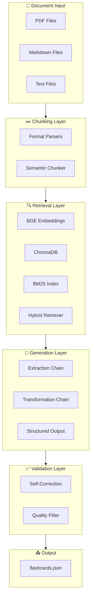
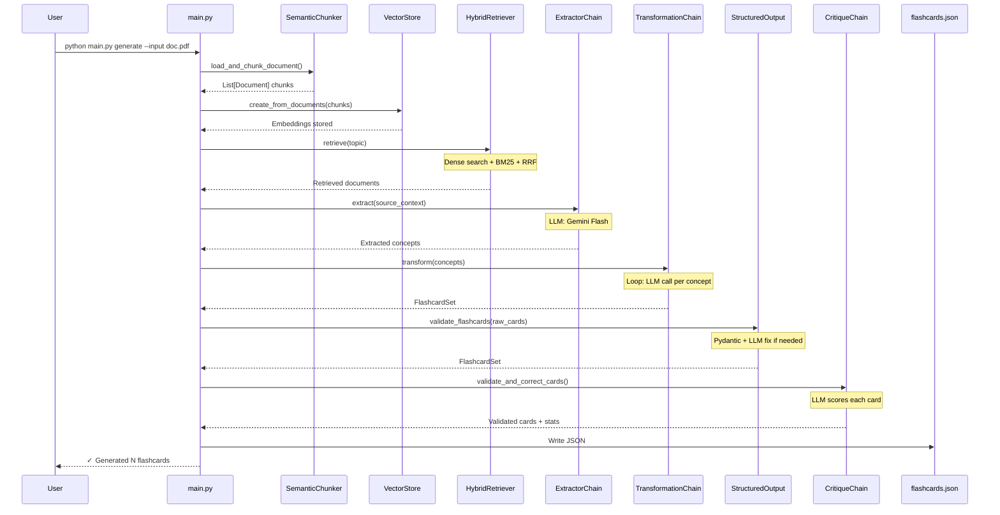

# Flashcard Generator: Complete Project Walkthrough

A comprehensive line-by-line explanation of how the flashcard generator pipeline works, from document ingestion to validated flashcard output.

---

## 📁 Project Architecture



---

## 🔧 Configuration ([config.py](file:///Users/alikomurcu/dev/genai/flashcard_generator/config.py))

The central configuration file that controls all pipeline parameters.

### Lines 1-13: Setup and Environment

```python
"""
Flashcard Generator Configuration
Centralized configuration for the entire pipeline.
"""

import os
from pathlib import Path
from dotenv import load_dotenv

load_dotenv()  # Load .env file with API keys
```

- **Purpose**: Load environment variables from `.env` file for secure API key management
- **Why**: Keeps sensitive credentials out of source code

### Lines 15-25: Path Configuration

```python
BASE_DIR = Path(__file__).parent
DATA_DIR = BASE_DIR / "data"
CHROMA_PATH = BASE_DIR / "chroma_db"
OUTPUT_DIR = BASE_DIR / "output"

DATA_DIR.mkdir(exist_ok=True)
OUTPUT_DIR.mkdir(exist_ok=True)
```

- **`BASE_DIR`**: Root directory of the project
- **`DATA_DIR`**: Where input documents are stored
- **`CHROMA_PATH`**: Persistent ChromaDB vector database location
- **`OUTPUT_DIR`**: Where generated flashcards are saved

### Lines 27-40: Model Configuration

```python
# LLM Configuration
LLM_MODEL = "gemini-flash-latest"
LLM_TEMPERATURE = 0.1  # Low for factual accuracy

# Embedding Configuration
EMBEDDING_MODEL = "all-MiniLM-L6-v2"
EMBEDDING_DIMENSION = 384
```

| Parameter | Value | Why |
|-----------|-------|-----|
| `LLM_MODEL` | `gemini-flash-latest` | Fast, cost-effective for structured output |
| `LLM_TEMPERATURE` | `0.1` | Low randomness = more factual outputs |
| `EMBEDDING_MODEL` | `all-MiniLM-L6-v2` | Fast for testing; switch to BGE-large for production |

### Lines 42-67: Chunking & Retrieval Settings

```python
# Chunking Configuration
CHUNK_SIZE = 800
CHUNK_OVERLAP = 150

SEMANTIC_SEPARATORS = [
    "\n# ",      # H1 headers
    "\n## ",     # H2 headers
    "\n### ",    # H3 headers
    "\n\n\n",    # Section breaks
    "\n\n",      # Paragraphs
    "\n",        # Lines
    ". ",        # Sentences
    " ",         # Words (fallback)
]

# Retrieval Configuration
RETRIEVAL_K = 10
BM25_WEIGHT = 0.4
DENSE_WEIGHT = 0.6
```

- **`CHUNK_SIZE=800`**: Large chunks preserve context (4-5 paragraphs)
- **`CHUNK_OVERLAP=150`**: Overlap prevents information loss at boundaries
- **`SEMANTIC_SEPARATORS`**: Priority list for where to split text (respects document structure)
- **`BM25_WEIGHT=0.4` / `DENSE_WEIGHT=0.6`**: Hybrid search favors semantic similarity slightly

---

## ✂️ Chunking Module

### Semantic Chunker ([semantic_chunker.py](file:///Users/alikomurcu/dev/genai/flashcard_generator/chunking/semantic_chunker.py))

The chunking module respects document structure rather than blindly splitting at character counts.

### Lines 25-59: SemanticChunker Class

```python
class SemanticChunker:
    def __init__(
        self,
        chunk_size: int = CHUNK_SIZE,
        chunk_overlap: int = CHUNK_OVERLAP,
        separators: List[str] = None,
    ):
        self.text_splitter = RecursiveCharacterTextSplitter(
            chunk_size=chunk_size,
            chunk_overlap=chunk_overlap,
            separators=self.separators,
            keep_separator=True,      # Keep headers in chunks
            add_start_index=True,     # Track position in original doc
        )
```

**How `RecursiveCharacterTextSplitter` works:**
1. Try to split at `\n# ` (H1 headers) first
2. If chunks are still too large, try `\n## ` (H2 headers)
3. Continue down the separator list until chunks fit
4. This ensures sections aren't split mid-paragraph

### Lines 61-84: Document Chunking

```python
def chunk_documents(self, documents: List[Document]) -> List[Document]:
    all_chunks = []
    
    for doc in documents:
        chunks = self.text_splitter.split_documents([doc])
        
        # Add tracking metadata
        for i, chunk in enumerate(chunks):
            chunk.metadata["chunk_index"] = i
            chunk.metadata["total_chunks"] = len(chunks)
        
        all_chunks.extend(chunks)
    
    return all_chunks
```

**What happens:**
1. Each document is split into chunks
2. Metadata tracks position (`chunk_index`) and context (`total_chunks`)
3. Original metadata (source file, page number) is preserved

### Lines 102-128: Parser Factory

```python
def get_document_loader(file_path: Union[str, Path]) -> BaseParser:
    path = Path(file_path)
    extension = path.suffix.lower()
    
    if extension in PDFParser.supported_extensions():
        return PDFParser(path)
    elif extension in MarkdownParser.supported_extensions():
        return MarkdownParser(path)
    elif extension in TxtParser.supported_extensions():
        return TxtParser(path)
    else:
        raise ValueError(f"Unsupported file type: {extension}")
```

**Parser Selection:**
- `.pdf` → `PDFParser` (extracts text with page numbers)
- [.md](file:///Users/alikomurcu/dev/genai/flashcard_generator/README.md) → `MarkdownParser` (preserves header structure)
- [.txt](file:///Users/alikomurcu/dev/genai/flashcard_generator/requirements.txt) → `TxtParser` (basic text processing)

---

## 🔍 Retrieval Module

### Embeddings ([embeddings.py](file:///Users/alikomurcu/dev/genai/flashcard_generator/retrieval/embeddings.py))

### Lines 17-41: Embedding Function

```python
@lru_cache(maxsize=1)  # Cache the model (expensive to load)
def get_embedding_function(model_name: str = None) -> HuggingFaceEmbeddings:
    model = model_name or EMBEDDING_MODEL
    
    model_kwargs = {"device": "cpu"}
    encode_kwargs = {"normalize_embeddings": True}  # Cosine similarity optimization
    
    return HuggingFaceEmbeddings(
        model_name=model,
        model_kwargs=model_kwargs,
        encode_kwargs=encode_kwargs,
    )
```

**Key Points:**
- **`@lru_cache`**: Model is loaded once and reused (avoiding 30+ second reload)
- **`normalize_embeddings=True`**: Normalizes vectors to unit length for cosine similarity
- **Device**: Runs on CPU (GPU would be faster but requires CUDA setup)

---

### Vector Store ([vector_store.py](file:///Users/alikomurcu/dev/genai/flashcard_generator/retrieval/vector_store.py))

### Lines 22-51: VectorStore Class

```python
class VectorStore:
    def __init__(
        self,
        persist_directory: str = None,
        collection_name: str = "flashcard_docs",
    ):
        self.persist_directory = persist_directory or str(CHROMA_PATH)
        self.collection_name = collection_name
        self.embedding_function = get_embedding_function()
        self._db = None
    
    @property
    def db(self) -> Chroma:
        """Lazy-load the database connection."""
        if self._db is None:
            self._db = Chroma(
                persist_directory=self.persist_directory,
                embedding_function=self.embedding_function,
                collection_name=self.collection_name,
            )
        return self._db
```

**Design Patterns:**
- **Lazy loading**: Database connection is created only when first accessed
- **Persistence**: ChromaDB saves to disk in `chroma_db/` directory
- **Collection**: All documents stored in `flashcard_docs` collection

### Lines 68-94: Creating from Documents

```python
def create_from_documents(
    self,
    documents: List[Document],
    clear_existing: bool = True,
) -> "VectorStore":
    if clear_existing:
        self.clear()
    
    self._db = Chroma.from_documents(
        documents=documents,
        embedding=self.embedding_function,
        persist_directory=self.persist_directory,
        collection_name=self.collection_name,
    )
    
    return self
```

**What happens when you ingest documents:**
1. Optionally clear existing data
2. Each document is embedded using the embedding function
3. Embeddings + metadata are stored in ChromaDB
4. Database is persisted to disk

---

### Hybrid Retriever ([hybrid_retriever.py](file:///Users/alikomurcu/dev/genai/flashcard_generator/retrieval/hybrid_retriever.py))

This is the **most sophisticated retrieval component**, combining two search strategies.

### Lines 23-65: Architecture

```python
class HybridRetriever:
    """
    Architecture:
    Query ──┬──> Dense Retriever (semantic)
            │     └──> BGE embeddings → ChromaDB
            │
            └──> Sparse Retriever (keyword)
                  └──> BM25 algorithm
                  
    Results merged via Reciprocal Rank Fusion (RRF)
    Optional re-ranking with FlashrankRerank
    """
    
    def __init__(
        self,
        vector_store: VectorStore,
        k: int = RETRIEVAL_K,
        bm25_weight: float = BM25_WEIGHT,
        dense_weight: float = DENSE_WEIGHT,
        use_reranker: bool = True,
    ):
        self.vector_store = vector_store
        self.k = k
        self.bm25_weight = bm25_weight
        self.dense_weight = dense_weight
        self._bm25_retriever = None  # Lazy loaded
```

**Why Hybrid Search?**

| Search Type | Good For | Weakness |
|-------------|----------|----------|
| Dense (Semantic) | "What is polymorphism?" | May miss exact terms |
| BM25 (Keyword) | "Define [__init__](file:///Users/alikomurcu/dev/genai/flashcard_generator/retrieval/hybrid_retriever.py#38-65) method" | Misses paraphrases |
| **Hybrid** | Both semantic + exact matches | Best of both worlds |

### Lines 88-145: The Retrieve Method

```python
def retrieve(
    self,
    query: str,
    doc_ids: Optional[List[str]] = None,
) -> List[Document]:
    
    # 1. Dense vector search
    filter_dict = None
    if doc_ids:
        filter_dict = {"doc_id": {"$in": doc_ids}}
    
    dense_results = self.vector_store.similarity_search(
        query, 
        k=self.k * 2,  # Get 2x results for fusion
        filter_dict=filter_dict
    )
    
    # 2. BM25 keyword search
    bm25_results = []
    if self.bm25_retriever:
        all_bm25 = self.bm25_retriever.invoke(query)
        bm25_results = [doc for doc in all_bm25 if doc.metadata.get("doc_id") in doc_ids]
    
    # 3. Combine using Reciprocal Rank Fusion
    combined = self._reciprocal_rank_fusion(
        [dense_results, bm25_results],
        [self.dense_weight, self.bm25_weight]
    )
    
    # 4. Apply re-ranking if available
    if self.reranker and combined:
        reranked = self.reranker.compress_documents(combined[:self.k * 2], query)
        combined = list(reranked)
    
    return combined[:self.k]
```

**Step-by-step:**
1. **Dense search**: Find semantically similar chunks using embeddings
2. **BM25 search**: Find chunks with matching keywords
3. **RRF fusion**: Combine results with weighted scoring
4. **Re-ranking**: Use a cross-encoder model to re-score results

### Lines 147-184: Reciprocal Rank Fusion

```python
def _reciprocal_rank_fusion(
    self,
    result_lists: List[List[Document]],
    weights: List[float],
    k: int = 60,  # RRF constant
) -> List[Document]:
    """
    RRF Score = Σ (weight / (rank + k))
    """
    doc_scores = {}
    doc_map = {}
    
    for results, weight in zip(result_lists, weights):
        for rank, doc in enumerate(results, start=1):
            content_key = doc.page_content[:200]  # Unique key
            
            if content_key not in doc_scores:
                doc_scores[content_key] = 0.0
                doc_map[content_key] = doc
            
            # RRF formula
            doc_scores[content_key] += weight / (rank + k)
    
    # Sort by combined score
    sorted_keys = sorted(doc_scores.keys(), key=lambda x: doc_scores[x], reverse=True)
    return [doc_map[key] for key in sorted_keys]
```

**RRF Example:**
- Document A: Rank 1 in dense, Rank 3 in BM25
- Score = (0.6 / (1+60)) + (0.4 / (3+60)) = 0.0098 + 0.0063 = **0.0161**
- Higher scores = more relevant across both retrieval methods

---

## 🧠 Generation Module

### Prompts ([prompts.py](file:///Users/alikomurcu/dev/genai/flashcard_generator/generation/prompts.py))

The prompts implement **"Flow Engineering"** - a multi-step pattern for controlled generation.

### Lines 19-61: Extraction Prompt

```python
EXTRACTION_PROMPT = """You are an Expert Knowledge Extractor...

## Extraction Categories

1. **KEY CONCEPTS**: Core ideas, principles, or patterns
2. **DEFINITIONS**: Technical terms with their precise meanings
3. **RELATIONSHIPS**: How concepts connect
4. **PROCEDURES**: Step-by-step processes
5. **EXAMPLES**: Concrete illustrations

## Output Format

For each piece of knowledge, output:

---
CONCEPT: [Name or title]
TYPE: [definition|principle|relationship|procedure|example]
DESCRIPTION: [Clear, accurate explanation]
RELATED_TO: [Comma-separated related concepts]
SOURCE_QUOTE: "[Exact quote from context]"
DIFFICULTY: [basic|intermediate|advanced]
---

## Rules

1. **GROUNDING**: Extract ONLY from provided context
2. **ACCURACY**: Preserve technical terminology exactly
3. **COMPLETENESS**: Capture all flashcard-worthy information
"""
```

**Design Philosophy:**
- **Structured output format**: Makes parsing reliable
- **Source quotes**: Forces LLM to ground in source material
- **Categories**: Helps generate diverse flashcard types

### Lines 68-126: Transformation Prompt

```python
TRANSFORMATION_PROMPT = """You are an Expert Flashcard Designer...

## Question Types (use variety):
- **Definition**: "What is [term]?"
- **Explanation**: "How does [X] work?"
- **Comparison**: "What is the difference between X and Y?"
- **Application**: "When would you use [X]?"
- **Procedure**: "What are the steps to [process]?"

## Answer Quality Guidelines:
- **Concise but complete**: 2-4 sentences is ideal
- **Include key terminology**: Use exact technical terms
- **Self-contained**: Answer makes sense alone
- **Accurate**: Must match source material exactly

## Output Format

{
  "cards": [
    {
      "question": "Clear, specific question",
      "answer": "Accurate answer based on source",
      "tag": "one_of_the_five_tags"
    }
  ]
}
"""
```

**Question Design Principles:**
- Variety of question types (definition, explanation, comparison)
- Answers are 2-4 sentences (not one-word)
- Tags categorize cards for filtering

---

### Extraction Chain ([extraction.py](file:///Users/alikomurcu/dev/genai/flashcard_generator/generation/extraction.py))

### Lines 24-46: ExtractorChain Class

```python
class ExtractorChain:
    def __init__(self, model_name: str = None, temperature: float = None):
        self.model = ChatGoogleGenerativeAI(
            model=model_name or LLM_MODEL,
            temperature=temperature if temperature is not None else LLM_TEMPERATURE,
        )
        
        self.prompt = ChatPromptTemplate.from_template(EXTRACTION_PROMPT)
        self.chain = self.prompt | self.model | StrOutputParser()
```

### Lines 45-61: ExtractorChain with Structured Output

```python
class ExtractorChain:
    def __init__(self, model_name: str = None):
        self.model = ChatGoogleGenerativeAI(model=model_name or LLM_MODEL)
        self.prompt = ChatPromptTemplate.from_template(EXTRACTION_PROMPT)
        
        # Enforce structured Pydantic output
        self.structured_llm = self.model.with_structured_output(ConceptList)
        self.chain = self.prompt | self.structured_llm
    
    def extract(self, context: str) -> ConceptList:
        return self.chain.invoke({"context": context})
```

**Key Shift**: Instead of returning raw text, this chain now returns a validated Python object (`ConceptList`), containing a list of `Concept` objects. This allows the next step (Transformation) to be deterministic.

---

### Transformation Chain ([transformation.py](file:///Users/alikomurcu/dev/genai/flashcard_generator/generation/transformation.py))

### Lines 21-55: TransformationChain

```python
class TransformationChain:
    def __init__(self, model_name: str = None, temperature: float = None):
        self.model = ChatGoogleGenerativeAI(
            model=model_name or LLM_MODEL,
            temperature=temperature if temperature is not None else LLM_TEMPERATURE,
        )
        
        self.prompt = ChatPromptTemplate.from_template(TRANSFORMATION_PROMPT)
        self.chain = self.prompt | self.model | StrOutputParser()
    
    def transform(self, concepts: ConceptList) -> FlashcardSet:
        """
        Transform extracted concepts into a FlashcardSet.
        
        loops through each concept in Python to guarantee 1-to-1 generation.
        """
        generated_cards = []
        
        for concept in concepts.concepts:
            # Deterministic: Create exactly one card per concept
            card = self.chain.invoke({
                "concept_name": concept.name,
                "concept_type": concept.type,
                "concept_description": concept.description,
                "concept_quote": concept.source_quote
            })
            generated_cards.append(card)
                
        return FlashcardSet(cards=generated_cards)
```

**Key Shift**: This function now receives a `ConceptList`. It iterates through this list in Python and calls the LLM for *each* concept individually. This guarantees 100% coverage and creates a predictable "One Concept = One Flashcard" relationship.

**Input**: `ConceptList` object
**Output**: `FlashcardSet` object containing generated cards

---

### Structured Output ([structured_output.py](file:///Users/alikomurcu/dev/genai/flashcard_generator/generation/structured_output.py))

### Lines 28-60: Pydantic Models


```python
class Flashcard(BaseModel):
    """Single flashcard with validation."""
    
    question: str = Field(..., min_length=10, description="The question text")
    answer: str = Field(..., min_length=10, description="The answer text")
    tag: Literal["definition", "concept", "procedure", "comparison", "application"]
    
    @field_validator('question', 'answer')
    @classmethod
    def clean_text(cls, v: str) -> str:
        """Clean and normalize text fields."""
        v = ' '.join(v.split())  # Remove excessive whitespace
        v = re.sub(r'\*\*([^*]+)\*\*', r'\1', v)  # Remove bold
        v = re.sub(r'\*([^*]+)\*', r'\1', v)      # Remove italic
        return v.strip()


class FlashcardSet(BaseModel):
    cards: List[Flashcard] = Field(..., min_length=1)
    
    def to_json(self, indent: int = 2) -> str:
        return json.dumps(self.to_dict(), indent=indent)
```

**Validation Features:**
- **Minimum lengths**: Questions and answers must be 10+ characters
- **Tag validation**: Only 5 allowed values (Literal type)
- **Automatic cleaning**: Removes markdown formatting, normalizes whitespace

### Lines 95-127: Validation with LLM Fallback

```python
def validate_flashcards(raw_output: str, use_llm_fix: bool = True) -> FlashcardSet:
    # Step 1: Extract JSON from potential wrapper text
    json_str = extract_json_from_text(raw_output)
    
    # Step 2: Try direct parsing
    try:
        data = json.loads(json_str)
        return FlashcardSet(**data)
    except (json.JSONDecodeError, Exception) as e:
        if not use_llm_fix:
            raise ValueError(f"JSON parsing failed: {e}")
    
    # Step 3: Use LLM to fix the JSON
    fixed_json = fix_json_with_llm(raw_output)
    
    try:
        data = json.loads(extract_json_from_text(fixed_json))
        return FlashcardSet(**data)
    except Exception as e:
        raise ValueError(f"Validation failed after LLM fix: {e}")
```

**Error Recovery:**
1. Try to extract JSON from markdown code blocks
2. If parsing fails, send to LLM for repair
3. LLM fixes syntax errors (missing quotes, commas, etc.)

---

## ✅ Validation Module

### Self-Correction ([self_correction.py](file:///Users/alikomurcu/dev/genai/flashcard_generator/validation/self_correction.py))

The **most sophisticated component** - uses LLM to critique its own output.

### Lines 29-92: Critique Prompt

```python
CRITIQUE_PROMPT = """You are a Quality Assurance Expert reviewing flashcards...

## Evaluation Criteria (Score 1-5 each)

1. **ACCURACY** (Critical): Does the answer match the source exactly?
   - 5: Perfect accuracy, every claim is directly supported
   - 3: Mostly accurate, minor imprecisions
   - 1: Contains significant errors or unsupported claims

2. **COMPLETENESS**: Does the answer cover the essential information?
3. **CLARITY**: Is the question unambiguous?
4. **RELEVANCE**: Is this a useful flashcard for studying?

## Output Format

{
  "accuracy_score": <1-5>,
  "completeness_score": <1-5>,
  "clarity_score": <1-5>,
  "relevance_score": <1-5>,
  "issues": ["list of specific problems"]
}
```

### Pydantic Models for Critique

```python
class CritiqueResult(BaseModel):
    """Result of critiquing a single flashcard."""
    accuracy_score: float = Field(..., ge=1, le=5)
    completeness_score: float = Field(..., ge=1, le=5)
    clarity_score: float = Field(..., ge=1, le=5)
    relevance_score: float = Field(..., ge=1, le=5)
    issues: List[str] = Field(default_factory=list)
    
    @property
    def verdict(self) -> str:
        """
        Calculate verdict deterministically in Python.
        - ACCEPT: Average score >= 4.0 AND Accuracy score >= 4
        - REJECT: Otherwise
        """
        if self.average_score >= 4.0 and self.accuracy_score >= 4:
            return "ACCEPT"
        return "REJECT"
```

### Lines 130-194: CritiqueChain

```python
class CritiqueChain:
    def __init__(self, model_name: str = None, temperature: float = None):
        self.model = ChatGoogleGenerativeAI(
            model=model_name or LLM_MODEL,
            temperature=temperature if temperature is not None else 0.1,  # Low for evaluation
        )
        
        self.chain = self.prompt | self.model | StrOutputParser()
    
    def critique(
        self,
        flashcard: Flashcard,
        source_context: str,
    ) -> CritiqueResult:
        response = self.chain.invoke({
            "source_context": source_context,
            "question": flashcard.question,
            "answer": flashcard.answer,
            "tag": flashcard.tag,
        })
        
        # Parse JSON response
        json_match = re.search(r'\{.*\}', response, re.DOTALL)
        if json_match:
            data = json.loads(json_match.group(0))
            return CritiqueResult(**data)
```

**What happens:**
1. Each flashcard is compared against the original source
2. LLM scores on 4 criteria (1-5 scale)
3. **Python Logic**: Calculates verdict:
   - `ACCEPT`: Average score >= 4.0 AND Accuracy >= 4
   - `REJECT`: Otherwise

### Lines 245-317: Main Validation Function

```python
def validate_and_correct_cards(
    card_set: FlashcardSet,
    source_context: str,
    min_score: float = None,
    model_name: str = None,
) -> Tuple[FlashcardSet, dict]:
    
    chain = CritiqueChain(model_name=model_name)
    accepted_cards = []
    statistics = {"total": 0, "accepted": 0, "revised": 0, "rejected": 0}
    
    for card in card_set.cards:
        critique = chain.critique(card, source_context)
        
        if critique.verdict == "ACCEPT":
            accepted_cards.append(card)
            statistics["accepted"] += 1
            
    return FlashcardSet(cards=accepted_cards), statistics
```

**Self-Correction Flow:**
1. For each card, get a critique
2. **ACCEPT**: Keep as-is (high quality)
3. **REJECT**: Drop the card (unfixable or low quality issues)

---

## 🚀 Main Pipeline ([main.py](file:///Users/alikomurcu/dev/genai/flashcard_generator/main.py))

### Lines 43-87: Ingest Command

```python
@cli.command()
@click.option('--input', '-i', 'input_path', required=True, type=click.Path(exists=True))
@click.option('--clear/--no-clear', default=True)
def ingest(input_path: str, clear: bool):
    """Ingest documents into the vector store."""
    
    input_path = Path(input_path)
    
    # Step 1: Load and chunk documents
    if input_path.is_dir():
        chunks = load_and_chunk_directory(input_path)
    else:
        chunks = load_and_chunk_document(input_path)
    
    # Step 2: Create vector store
    vector_store = VectorStore()
    vector_store.create_from_documents(chunks, clear_existing=clear)
```

**Usage:**
```bash
python main.py ingest --input /path/to/documents
```

### Lines 121-215: Generate Command (The Main Pipeline)

```python
@cli.command()
def generate(input_path, topic, output_path, max_cards, validate, doc_ids):
    """Generate flashcards from documents."""
    
    vector_store = VectorStore()
    
    # Optional: Ingest if input provided
    if input_path:
        chunks = load_and_chunk_document(input_path)
        vector_store.create_from_documents(chunks, clear_existing=True)
```

**Step 1: Retrieve Relevant Content**
```python
    retriever = create_hybrid_retriever(vector_store)
    retrieved_docs = retriever.retrieve(topic, doc_ids=doc_id_list)
    source_context = format_retrieved_docs(retrieved_docs)
```

**Step 2: Extract Concepts**
```python
    extractor = ExtractorChain()
    extracted = extractor.extract(source_context)
```

**Step 3: Transform to Flashcards**
```python
    transformer = TransformationChain()
    raw_cards = transformer.transform(extracted)
```

**Step 4: Self-Correction (Optional)**
```python
    if validate:
        card_set, stats = validate_and_correct_cards(card_set, source_context)
```

**Step 5: Save Output**
```python
    with open(output_file, 'w') as f:
        json.dump(card_set.to_dict(), f, indent=2)
```

---


---

## 🔄 Runtime Data Flow: Generation & Validation Walkthrough

To understand exactly how the system works, let's trace a single request through the Generation and Validation pipeline.

**Scenario**: User requests flashcards about "Reciprocal Rank Fusion" from the ingested documents.

### Step 1: Retrieval & Formatting
The system retrieves relevant chunks.
**Input**: Query "Reciprocal Rank Fusion"
**Retrieval Output** (Simplified):
```text
[Source: hybrid_retriever.py | Page: N/A]
doc_scores = {}
for results, weight in zip(result_lists, weights):
    for rank, doc in enumerate(results, start=1):
        # RRF formula: Score = weight / (rank + k)
        doc_scores[content_key] += weight / (rank + k)
```

**Formatted Context**:
The `format_retrieved_docs` function combines these into a single context string annotated with source info.

### Step 2: Key Concept Extraction
The `ExtractorChain` analyzes the context to identify learnable concepts.

**LLM Guide**: `EXTRACTION_PROMPT`
**Output**: `ConceptList` containing:

```python
[
    Concept(
        name="Reciprocal Rank Fusion (RRF)",
        type="principle",
        description="An algorithm for combining results...",
        source_quote="Score = weight / (rank + k)",
        difficulty="intermediate"
    ),
    Concept(
        name="RRF Formula",
        type="definition",
        description="The mathematical formula...",
        source_quote="Score = Σ (weight / (rank + k))",
        difficulty="advanced"
    )
]
```

### Step 3: Transformation to Q&A (Loop)
The `TransformationChain` iterates over the `ConceptList`.

**Iteration 1**:
**Input**: RRF Concept
**LLM Prompt**: "Create ONE flashcard for 'Reciprocal Rank Fusion'..."
**Output** (single object):
```json
{
  "question": "What is the primary purpose of Reciprocal Rank Fusion (RRF)?",
  "answer": "Reciprocal Rank Fusion (RRF) is an algorithm designed to combine search results...",
  "tag": "concept"
}
```

**Iteration 2**:
**Input**: RRF Formula Concept
**LLM Prompt**: "Create ONE flashcard for 'RRF Formula'..."
**Output** (single object):
```json
{
  "question": "Explain the mathematical formula for Reciprocal Rank Fusion.",
  "answer": "The RRF score is calculated as the sum of (weight / (rank + k))...",
  "tag": "definition"
}
```

### Step 4: Self-Correction (Validation Layer)
The `validate_and_correct_cards` function mimics a human review.

**Card to Review**:
> **Q**: Explain the mathematical formula for Reciprocal Rank Fusion.
> **A**: The RRF score is calculated as the sum of (weight / (rank + k))...

**LLM Critique Prompt**: `CRITIQUE_PROMPT` + Source Context + Card
**LLM Critique Output**:
```json
{
  "accuracy_score": 5,
  "completeness_score": 4,
  "clarity_score": 5,
  "relevance_score": 5,
  "issues": []
}
```
*Result*: **Avg 4.75** → Card is **ACCEPTED**.

**Hypothetical "Bad" Card**:
> **Q**: What is "k"?
> **A**: k is a number.

**LLM Critique Output**:
```json
{
  "accuracy_score": 2,
  "completeness_score": 1,
  "clarity_score": 2,
  "relevance_score": 5,
  "issues": ["Answer is too vague", "Does not explain the purpose of k"]
}
```
*Result*: **Avg 2.5** → Card is **REJECTED**.

### Final Output
The process finishes with a validated, filtered, and polished list of flashcards saved to `output/flashcards.json`.

---

## 📊 Complete Pipeline Diagram



---

## 📈 LLM Call Summary

| Step | LLM Calls | Model | Purpose |
|------|-----------|-------|---------|
| Extraction | 1 | Gemini Flash | Extract concepts from context |
| Transformation | N | Gemini Flash | Convert each concept to a flashcard |
| Self-Correction | N | Gemini Flash | Critique each of N cards |

**Total LLM calls per run:** 1 + 2N (where N = number of concepts)

---

## 🎯 Key Design Decisions

1. **Multi-step generation** instead of single prompt → More control, better quality
2. **Hybrid retrieval** → Catches both semantic and keyword matches
3. **Self-correction** → LLM validates its own output against source
4. **Pydantic validation** → Guarantees output schema compliance
5. **LLM error recovery** → Gracefully handles malformed JSON
